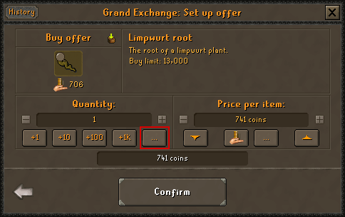

GE Calc
=============
Use maths to set price and quantity in GE!

Usage
------
The plugin enabled the use of expressions to set the price and/or quantity using the Grand Exchange.

| Input  | Result |
| ------------- | ------------- |
| 45 * 4  | 180  |
| 180 / 4  | 45  |
| 100 + 100  | 200  |
| 100 - 50  | 50  |

This plugin also allows entering of decimal values followed by a unit:

| Input  | Result |
| ------------- | ------------- |
| 5.63k  | 5,630  |
| 8.5m  | 8,500,000  |
| 1.024b  | 1,024,000,000  |

| NOTE: Expressions cannot include unit values, for example: '1.5k * 2' or '8k + 4.6k' will not work!
| --- |

| NOTE: The Grand Exchange quantity and price input windows contain an asterisk '*' at the end of the text field. This is only visual and does not impact the result.
| --- |

License
-------
GE Calc is licensed under the BSD 2-Clause License. See LICENSE for info.

Author
------
cman8396, Large Chongus